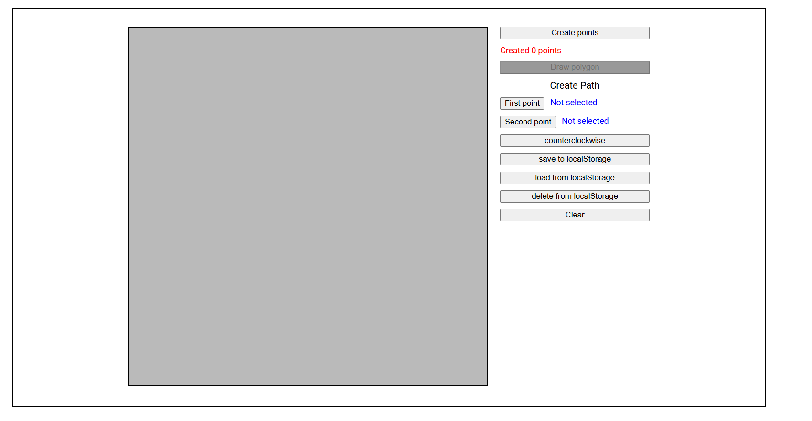
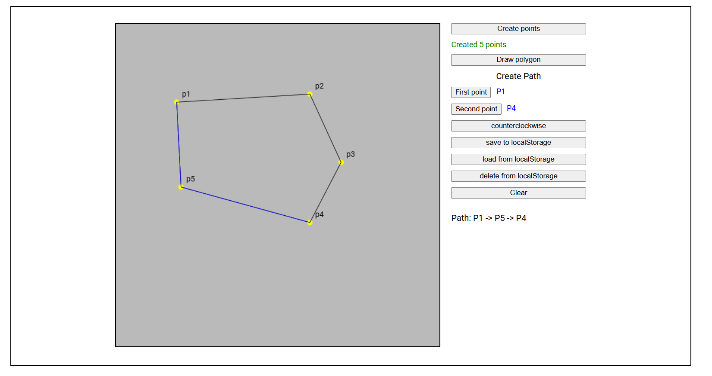

# Тестовое задание на позицию Frontend разработчика

## Выполнил: Усманов Абдурахман

### Контакты:

- email: ausmanov706@gmail.com
- tg: @Ausm2002

Задание:
Создать приложение, используя веб компоненты (без использования React, Vue и т.д.),
которое позволит пользователю:

1. создать полигон с произвольным количеством вершин
2. определить путь между двумя произвольными вершинами полигона

### Инструкция по запуску:

- Установите зависимости: `npm install`
- Запустите приложение: `npm run start`
- Приложение запуститься на порту `http://localhost:8998/`

### Скриншоты интерфейса:

